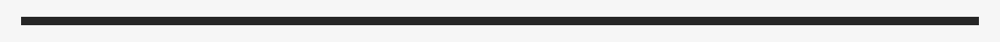
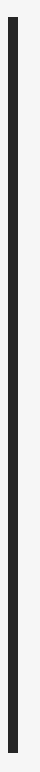
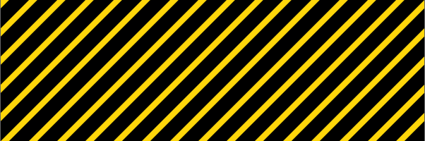
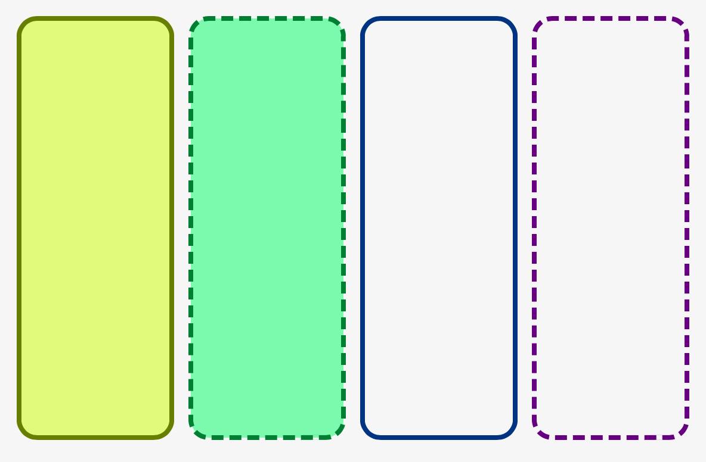

# SUEShapes

SwiftUI Shapes

<p align="center">
<a href="LICENSE.md">
    
</a>
<a href="https://swift.org">
    
</a>

SUE stands for *S*wift*U*I *E*xtras and is a collection of small SwiftUI libraries for various recurring use cases

## Gallery

### HorizontalLine
```swift
HorizontalLine().stroke(lineWidth: 5).padding()
```



### VerticalLine
```swift
VerticalLine().stroke(lineWidth: 5).padding()
```



### Stripes
```swift
Stripes().stroke(Color.black, lineWidth: 10).background(Color.yellow)
```



### RoundedCorners
```swift
HStack {
    VStack(spacing: 0) {
        RoundedCorners(hue: 0.2, part: .start)
        RoundedCorners(hue: 0.2, part: .middle)
        RoundedCorners(hue: 0.2, part: .middle)
        RoundedCorners(hue: 0.2, part: .middle)
        RoundedCorners(hue: 0.2, part: .middle)
        RoundedCorners(hue: 0.2, part: .end)
        Spacer()
    }
    VStack(spacing: 0) {
        RoundedCorners(hue: 0.4, part: .start, type: .dashed)
        RoundedCorners(hue: 0.4, part: .middle, type: .dashed)
        RoundedCorners(hue: 0.4, part: .middle, type: .dashed)
        RoundedCorners(hue: 0.4, part: .end, type: .dashed)
        Spacer()
    }
    VStack(spacing: 0) {
        RoundedCorners(hue: 0.6, part: .start, type: .regularOutline)
        RoundedCorners(hue: 0.6, part: .middle, type: .regularOutline)
        RoundedCorners(hue: 0.6, part: .middle, type: .regularOutline)
        RoundedCorners(hue: 0.6, part: .middle, type: .regularOutline)
        RoundedCorners(hue: 0.6, part: .middle, type: .regularOutline)
        RoundedCorners(hue: 0.6, part: .middle, type: .regularOutline)
        RoundedCorners(hue: 0.6, part: .end, type: .regularOutline)
        Spacer()
    }
    VStack(spacing: 0) {
        RoundedCorners(hue: 0.8, part: .start, type: .dashedOutline)
        RoundedCorners(hue: 0.8, part: .middle, type: .dashedOutline)
        RoundedCorners(hue: 0.8, part: .end, type: .dashedOutline)
        Spacer()
    }
    
    
}.padding()
```




## License

MIT license; see [LICENSE](LICENSE.md).
(c) 2020
